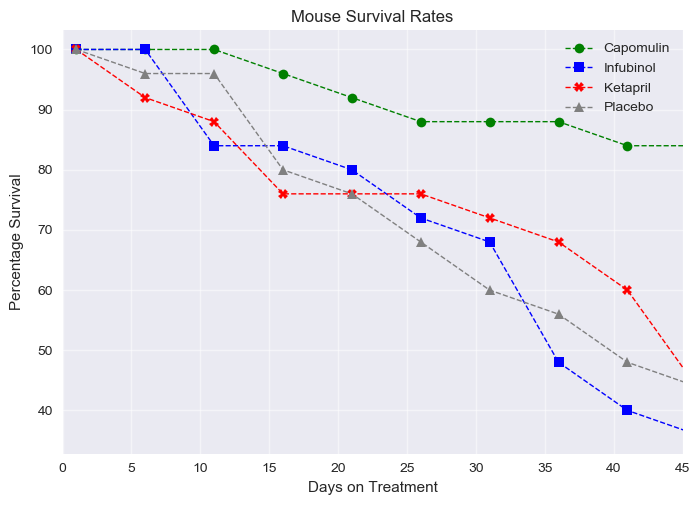
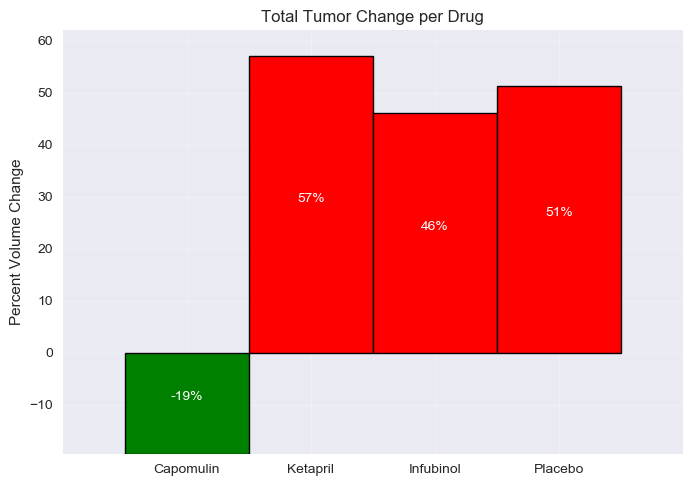
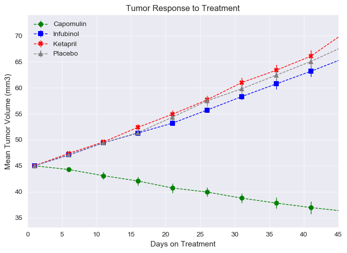

# Pymaceuticals

An analysis of sample data from a trial of cancer drugs on mice utilizing pandas & matplotlib. 
See the [jupyter notebook](./Pymaceuticals/Pymaceuticals.ipynb).

### Findings

1.  Out of the total data sets there were only two drugs that passed. Those drugs were Capomulin and Ramicane. 
2. Many of the drugs seemed to intensify the effects of cancer on the mice, for example taking Infubinol was worse for survival then a Placebo.
3. In parsing through the data set I noticed some strange data items, such as extra mice (26 rather then 25) for specific drugs.

### Additional Figures

This project was completed for Rutgers Data Science Bootcamp and can be found [here](https://github.com/RutgersCodingBootcamp/RU-JER-DATA-PT-10-2019-U-C/tree/master/Homework/05-Matplotlib/Instructions). 
